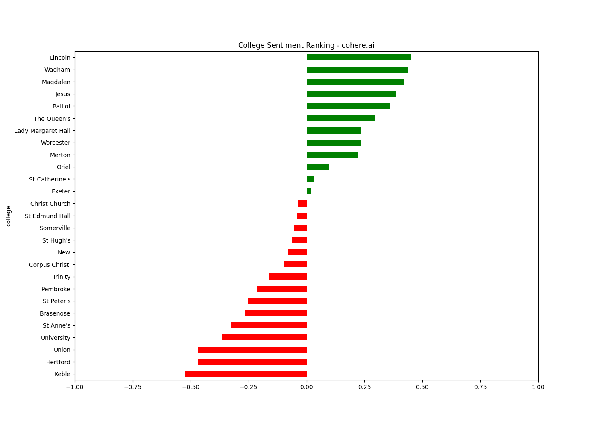

# Oxfess Sentiment Analysis

This repository contains evaluations of sentiment analysis of different colleges of the University of Oxford, based on the relevant posts from the [Oxfess](https://www.facebook.com/oxfessions) Facebook page, using various engines, including [cohere.ai](https://cohere.ai/)'s Sentiment Analysis engine and models trained on Twitter data.

### TODO: 
- [x] Download data from Oxfess
- [x] Run with cohere.ai engine
- [ ] Train models on Twitter data:
  - [ ] LSTM
  - [ ] BiLSTM
  - [ ] Transformer

## Data	
The data used in this project is available in the `data` folder. It contains all Oxfess' posts from March 2022 to December 2022 in `.txt` format (in total, over 2,500 posts).

## Evaluation results
Each model was ran on all posts containing at least one college name, assigning each post a value between -1 and 1, where -1 is the most negative sentiment and 1 is the most positive sentiment. Afterwards, the average sentiment of each college was calculated, and the results are presented in the graphs below.

### cohere.ai
[Cohere.ai](https://cohere.ai/) provides free-to-use models for Sentiment Analysis, Text Generation and other NLP tasks. In the experiment, I used a 'large' Sentiment Analysis model, with context generated by 40 randomly selected Oxfess posts, with masked college names if necessary.

